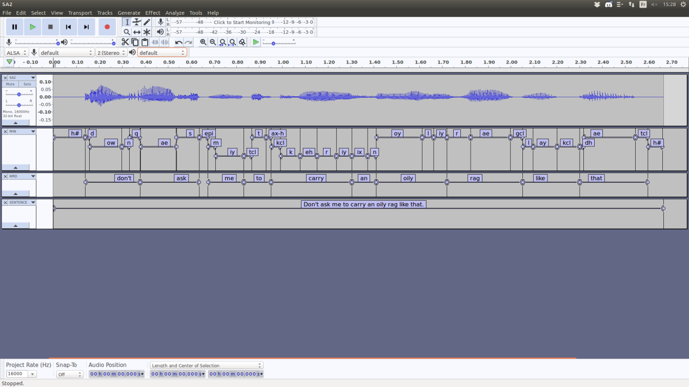

Audacity script for TIMIT files
=================================

Description
-----------

Opens a wave file of the TIMIT database in Audacity and adds the phonetic data from the TIMIT segmentation in Label Tracks.

Scripting
----------

This is a [script for Audacity](https://manual.audacityteam.org/man/scripting.html) written in Python 2.7.

Audacity has to be installed from source and *mod-script-pipe* enabled. [Compilation info](https://github.com/audacity/audacity/blob/master/INSTALL).

Help
----

Type

    python audacity-timit.py --help
for some help. File can be chosen by the user or at random in the database. Works for an empty Audacity project.

Screenshot
-----------

